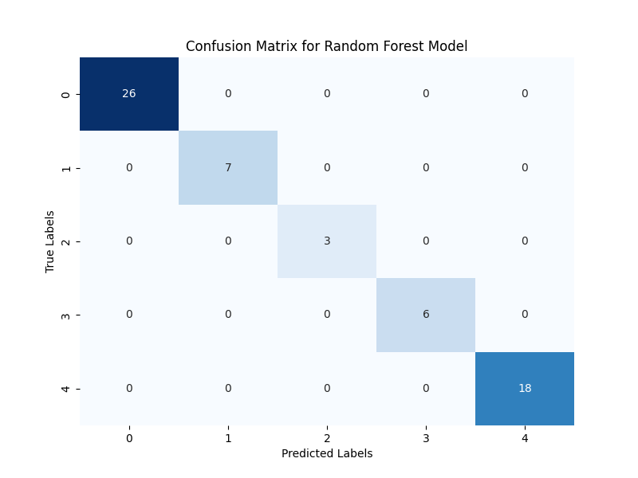
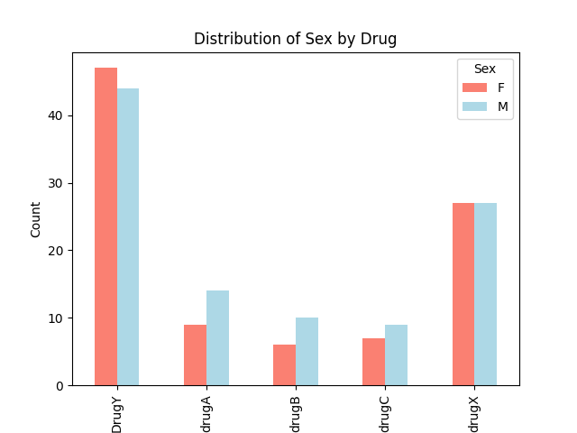
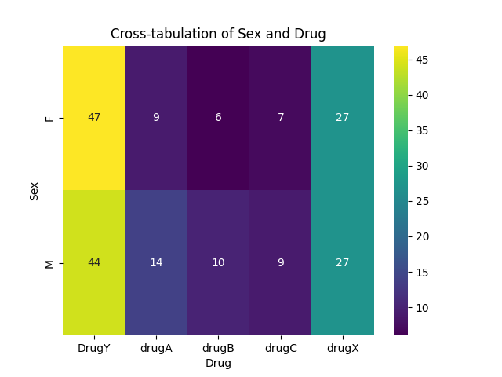
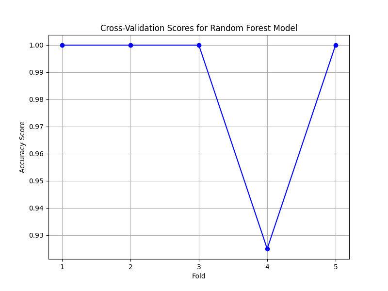
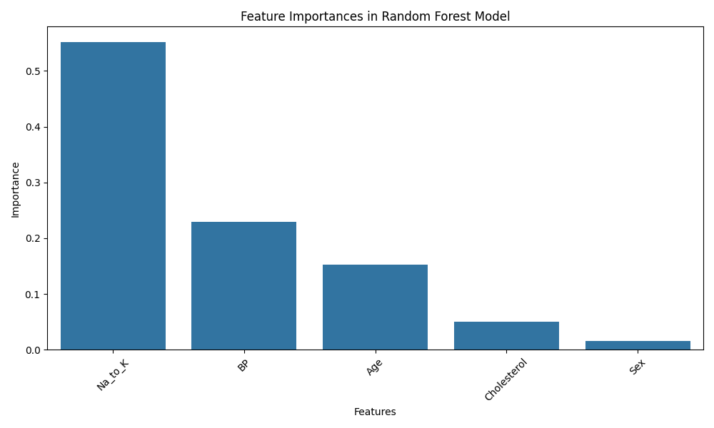

<!DOCTYPE html>
<html>
<head>
    <link rel="stylesheet" type="text/css" href="style.css">
</head>
<body>
    <h2 align="center" class="big-text">Drug Classification</h2>
    <h5 align="center" class="big-text">The feature sets are:
Age
Sex
Blood Pressure Levels (BP)
Cholesterol Levels
Na to Potassium Ration
Inspiration
The main problem here in not just the feature sets and target sets but also the approach that is taken in solving these types of problems as a beginner. So best of luck.</h2>
    
    
    
    
    
</body>
</html>
